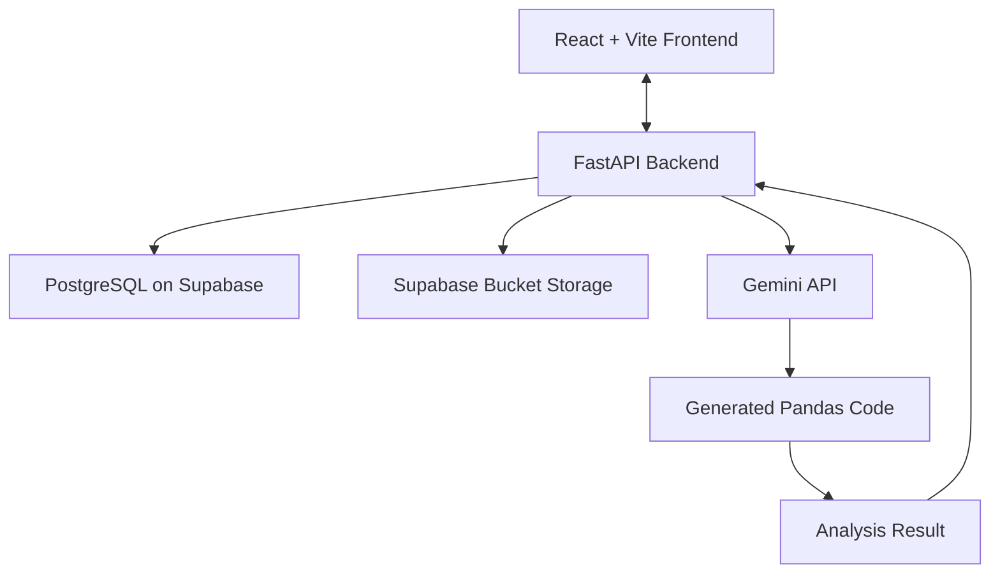

# DataLens AI Frontend - Overview 

This is the React frontend for **DataLens AI**, a full-stack AI data analysis application that allows users to create new chats, upload datasets (Provided they can be read by the Pandas library in Python), and ask questions about their data.

The backend handles user authentication, chat session management, message processing, database queries, object storage, and API communication with the frontend. Rather than directly having an AI answer the question, instead we ask it to generate and run Python code, using the Pandas library to conduct data analysis. This was done to hedge against the hallucination of AI models. 

## Features

* User registration and login
* Per-user chat session management
* Create, retrieve, and delete chat sessions
* Send messages to a selected chat

Currently in progress: Account deletion 

## Architecture

Please take a look at the diagram below:

## Tech Stack 
**Backend:** FastAPI, Uvicorn (ASGI server), Pandas (Data analysis), PandasAI (AI for pandas), python-jose (JWT based authentication), psycopg2 (Database connection), bcrypt (Hashing passwords), python-multipart (Form data handling), python-dotenv (Environment variables), supabase (Storage and database client), sib-api-v3-sdk (Brevo SDK)  
**Frontend:** React + Vite (Javascript), React 3F and Drei (Visuals), React Router, react-markdown (Markdown rendering), remark-gfm (GitHub flavored markdown), three (3D library)  
**Deployment:** Docker, Supabase (Bucket storage and PostgreSQL database), Railway (Backend), Render (Frontend)  
**Third Party APIs:** Gemini (AI features), Brevo (Sending emails)  

**For Local Development:**  
- The VITE_API_URL was set to the locally running backend for testing and further development 

## Security Features
- Encryption 
- JWT based authentication
- Email verification on signup 
- API Rate Limiting 

A security note on the AI generated code: The only context we pass into the AI is the user's question, the chat history, and the dataset, if applicable. The AI does NOT have access to sensitive information such as the user's identity or the environment variables. 